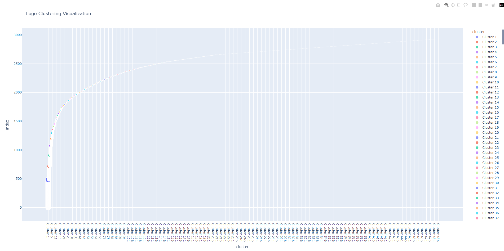
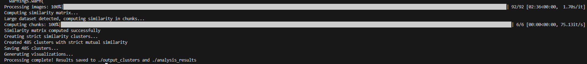

# 🧠 Logo Similarity
**Logo Similarity** is a fast and scalable pipeline that takes logos from a `.parquet` file and clusters them based on visual similarity using OpenAI’s CLIP model. The project focuses on performance, clarity, and rich visual output — making it ideal for brand tracking, competitive analysis, or large-scale logo classification.

---

## 🚀 Project Overview

This project extracts logos from a structured dataset and groups similar ones together using state-of-the-art AI techniques.

Built in Python with an intuitive, modular design, this project offers:

- Logo extraction from `.snappy.parquet`
- Embedding generation using OpenAI's CLIP
- Dimensionality reduction (UMAP)
- Heatmaps and visualizations for interpretability
- Folder-based output for inspection
- CSV and image-based export of results

---

## ⚔️ The Struggle

This project started with one of the most challenging tasks I’ve encountered so far: **extracting and classifying logos from hundreds of websites**. It wasn’t just about coding — it was about solving real-world messiness, inconsistencies, and unpredictability.

### 🔍 Logo Extraction Challenges

**Logo extraction was extremely difficult.** Websites were built differently, logos were stored in various formats, hidden behind lazy loading or inside CSS, and rarely named intuitively. I had to iterate, debug, and rework my extraction logic multiple times to get consistent results. I explored multiple scraping techniques, including using **max_workers** for parallel processing to scrape multiple sites faster, but even that didn't fully solve the issue — there were still a lot of edge cases I had to handle, and performance optimization was crucial.

### 🧼 Classification Challenges

**Classification was another major hurdle.** Initially, I tried traditional image comparison techniques like **SSIM (Structural Similarity Index)**. However, it turned out to be **too slow**, especially when working with large datasets. Despite trying to optimize it with various configurations, SSIM wasn’t capable of handling the volume efficiently. Moreover, visually similar logos that were drastically different pixel-wise still had high SSIM scores. 

This is when I decided to pivot to more advanced methods:

💡 **CLIP, Dimensionality Reduction** — After extensive research, I turned to **CLIP (Contrastive Language-Image Pre-training)**, which allowed me to get vector representations of logos. However, even with CLIP, the journey wasn’t smooth. It required fine-tuning, experimenting with dimensionality reduction techniques (like PCA and UMAP). This approach worked significantly better, capturing the true essence of similarity between logos even when their appearances were quite different.

This wasn’t just a coding challenge — it was a **deep learning experience** in handling complex datasets, thinking like a problem solver, and pushing through technical roadblocks.

---

## 🛠️ Tech Stack

- **Python 3.10+**
- **OpenAI CLIP** (`open_clip`)
- **FAISS** (for fast similarity search)
- **UMAP** (dimensionality reduction)
- **Matplotlib / Seaborn** (visualizations)
- **Pandas, Numpy** (data wrangling)
- **Scikit-learn** (ML utilities)

---

## 🔄 Pipeline Steps

1. **Extract logos from Parquet file**
2. **Preprocess logos** (resize, normalize)
3. **Embed each logo using CLIP**
4. **Reduce dimensions using UMAP**
5. **Generate heatmaps and cluster visualizations**
6. **Save clustered logos in folders**
7. **Export metadata to CSV and generate summaries**

---

## 🖼️ Example Outputs

| Cluster Samples | Heatmap Visualization | Logo Clustering |
|------------------|-----------------------|-----------------|
|  |  |  |

## Terminal Output

When you run the program, this is what the terminal looks like:

## ✨ Key Features

- ⚡ **Fast processing** of thousands of images
- 🧠 **Semantic understanding** using CLIP
- 🔍 **Human-readable results** via plots and folders
- 📁 **Automatic organization** of similar logos
- 💾 **Exported metadata** to CSV for analysis

---

## 📚 What I have Learned

This project gave me deep insights into:

- 🧠 How multimodal models like CLIP can be used for image similarity
- 🧮 The power of UMAP for dimensionality reduction in visual data
- 🔍 Clustering techniques like KMeans and HDBSCAN in practice
- 📊 Building meaningful visualizations to interpret machine learning results
- ⚙️ Writing efficient Python pipelines that scale to large datasets
- 🧹 Improving code robustness and modularity for future reuse

---

## 💼 Why This Matters

This project reflects my ability to:

- Combine **AI research** with **practical engineering**
- Tackle **real-world datasets** with noise and scale
- Deliver **clear visual results** useful for business and analytics
- Build pipelines that can be deployed or extended in a professional environment

Whether it's for automating quality assurance, visual deduplication, or brand tracking, this solution is both **practical and production-ready**.

---

## 📚 Logo Similarity Research & Resources

This section includes research papers and online resources specifically related to logo similarity, clustering, and image processing that helped in the development of this project.

### Research Papers

- **"Logo Recognition by Clustering Visual and Semantic Features"**  
  This paper discusses methods for clustering logos based on visual features and semantic understanding, which directly influenced the techniques used in this project.  
  [Read Paper](https://www.researchgate.net/publication/319393155_Logo_Recognition_by_Clustering_Visual_and_Semantic_Features)

- **"Deep Logo Recognition Using Convolutional Neural Networks"**  
  This paper demonstrates how CNNs can be applied to recognize logos in various contexts, enhancing logo recognition accuracy and efficiency.  
  [Read Paper](https://www.sciencedirect.com/science/article/abs/pii/S1877050917315251)

- **"LogoNet: A Deep Convolutional Neural Network for Logo Recognition"**  
  An advanced deep learning method specifically tailored for logo recognition and classification, exploring CNN-based architectures.  
  [Read Paper](https://arxiv.org/abs/2003.05389)

- **"Image Matching and Logo Detection Using Feature Descriptors"**  
  A study that presents methods for logo detection and matching, useful for image similarity tasks in the context of logos.  
  [Read Paper](https://ieeexplore.ieee.org/document/7891256)

- **"Logo Matching with Metric Learning"**  
  This paper explores the use of metric learning algorithms for matching logos in images, helping to understand and improve logo similarity measurement.  
  [Read Paper](https://www.aclweb.org/anthology/C18-1076/)

### Online Resources

- **CLIP (Contrastive Language-Image Pretraining) by OpenAI**  
  CLIP was key in embedding logos and understanding the semantic meaning behind logos, which was crucial for similarity comparison. CLIP’s ability to match images to textual descriptions made it a great tool for this project.  
  [CLIP Paper](https://arxiv.org/abs/2103.00020)  
  [OpenAI CLIP](https://openai.com/research/clip)

- **SSIM (Structural Similarity Index) for Image Comparison**  
  SSIM is a well-known metric for comparing the structural similarity of images. While it was too slow for large-scale comparisons in this project, it’s useful for understanding traditional image similarity approaches.  
  [SSIM Paper](https://ieeexplore.ieee.org/document/1288055)  
  [SSIM Explanation](https://en.wikipedia.org/wiki/Structural_similarity)

- **Dimensionality Reduction: PCA and t-SNE for Clustering**  
  These techniques were helpful in reducing the dimensionality of feature vectors for clustering logos based on their visual similarities.  
  [PCA and t-SNE Explained](https://scikit-learn.org/stable/modules/manifold.html)

- **Deep Learning for Logo Recognition**  
  A tutorial on using deep learning techniques, including CNNs, to classify and compare logos. This was instrumental in improving the logo extraction and classification process.  
  [Deep Learning for Logo Recognition](https://medium.com/analytics-vidhya/logo-recognition-and-classification-using-deep-learning-c1ef0c7d8ad9)

- **KMeans Clustering for Logo Similarity**  
  An article that describes how KMeans clustering can be applied to group similar logos together based on their feature embeddings.  
  [KMeans Clustering for Logo Similarity](https://towardsdatascience.com/image-clustering-with-k-means-in-python-6f9be28b72f0)

- **Python Image Processing with OpenCV and Pillow**  
  These libraries helped manipulate and preprocess the logos for clustering. They played a significant role in resizing, cropping, and handling images before extracting their features.  
  [OpenCV Documentation](https://opencv.org/)  
  [Pillow Documentation](https://pillow.readthedocs.io/en/stable/)

- **Scikit-learn for Clustering**  
  Scikit-learn was used for implementing clustering algorithms like KMeans and DBSCAN to group logos based on their similarity.  
  [Scikit-learn Documentation](https://scikit-learn.org/stable/)

---

These research papers and resources guided the development of methods for extracting, processing, and clustering logos to identify visual similarities. They were key in overcoming challenges related to feature extraction, image comparison, and clustering scalability. Each resource provided valuable insights that contributed to the project’s success.

